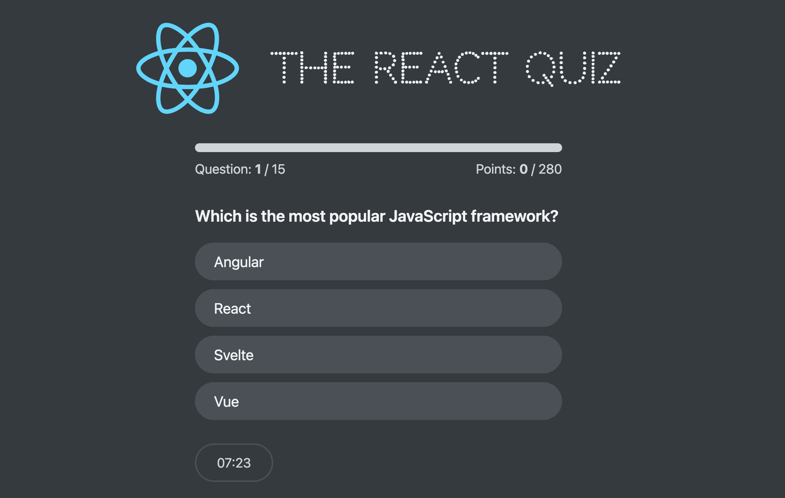

# Mini-Quizz App



## About
The **Mini-Quizz App** is a React-based quiz application designed to help users test their React skills. The app presents 15 randomly selected React-related questions, with each question having a time limit of 30 seconds. After **the limited time has passed**, the game automatically stops, and users can see their score for that attempt.

## Features
- **Test React skills** by answering 15 random quiz questions.
- **Automatic game termination** once the time limit is reached.
- **Score tracking** to display points earned in each attempt.
- **Highest score retention** to showcase the all-time best performance.
- **Global state management** using `useReducer` and Context API.
- **Fake API** powered by `json-server` for fetching quiz questions.
- **Focus on `useReducer`** over `useState` for state management.

I built this app to enhance my understanding of `useReducer` and Context API in a practical scenario.

You can check out the **TypeScript version** in the `fisheeesh` branch.

## Installation

Follow these steps to set up the project locally:

1. **Clone the repository:**
   ```sh
   git clone https://github.com/fisheeesh/quiz.git
   cd quiz
   ```
2. **Install dependencies:**
   ```sh
   npm install
   ```
3. **Install JSON Server:**
   ```sh
   npm install json-server
   ```
4. **Start the JSON server:**
   ```sh
   json-server --watch src/databae/questions.json --port 3000
   ```
5. **Run the development server:**
   ```sh
   npm run dev
   ```
